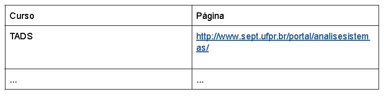

<h1>Exercício 1 - Servlets/JSP Básico
</h1>

Crie um projeto contendo uma Servlet e um JSP.

A Servlet deve apresentar uma página Web contendo as informações do SEPT, que podem ser obtidas pelo seguinte endereço:

 

http://www.sept.ufpr.br/portal/

    Mostre as seguintes informações:
    <ul>
    <li>Nome do Setor : em azul fonte Verdana grande</li>
        <li> Endereço completo do setor: em preto fonte Arial pequeno</li>
    <li> 

    
   <li>
        Uma tabela contendo todos os cursos do setor e um link para sua página, da seguinte forma:
    </li>
    
    <li>
        Um link para a JSP que você irá desenvolver, que se chama "Meu TADS"
    </li>
    <li>
        Uma logo e o nome do curso, como cabeçalho
    </li>
    <li>
        Uma tabela contendo o nome de todos os integrantes da equipe e um link para seus perfis em sua rede social favorita
    </li>
    <li>
        Um link chamado "Voltar" que leva o usuário até a Servlet que você desenvolveu

  
</ul>

